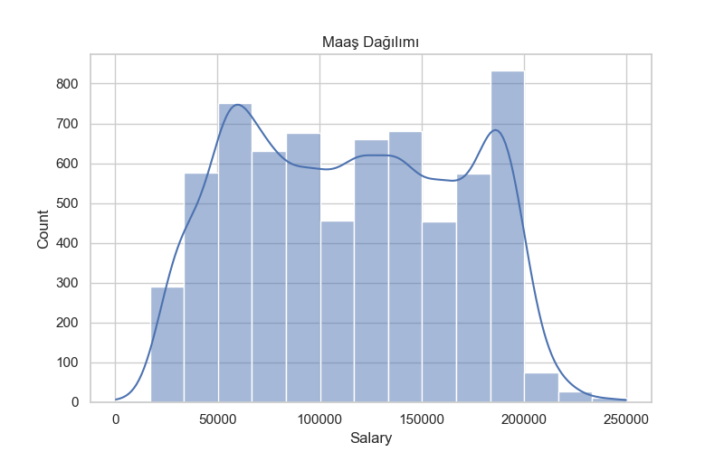

# Salary Data Analysis / Maaş Verisi Analizi

# Salary Data Analysis / Maaş Verisi Analizi

Bu proje, bir şirketin çalışan maaş verilerini analiz etmek için Python kullanılarak yapılmıştır.  
Veri temizleme, keşifsel veri analizi ve görselleştirme adımlarını içermektedir.  
Amaç, maaş dağılımları, deneyim ilişkisi ve eğitim seviyesine göre özet istatistikleri görselleştirmektir.

This project analyzes a company's employee salary data using Python.  
It includes data cleaning, exploratory data analysis, and visualization steps.  
The goal is to summarize salary distributions and analyze relationships with experience and education levels.

---

## Kullanılan Teknolojiler / Technologies Used
- Python
- Pandas
- NumPy
- Seaborn
- Matplotlib

---

## Proje Adımları / Project Steps

1. **Veri Keşfi / Data Exploration**  
   - `df.head()`, `df.info()`, `df.describe()`, `df.isnull().sum()` ile veri yapısı ve eksik değerler incelendi.  
   - Explored data structure and missing values using `df.head()`, `df.info()`, `df.describe()`, `df.isnull().sum()`.

2. **Eksik Veri Doldurma / Handling Missing Data**  
   - `Salary` sütunundaki eksik değerler önceki değerle (`ffill`) dolduruldu.  
   - `Years of Experience` sütunundaki eksik değerler ortalama ile dolduruldu.  
   - Filled missing values in the `Salary` column using forward fill (`ffill`).  
   - Filled missing values in `Years of Experience` column with the mean.

3. **Veri Temizleme / Data Cleaning**  
   - `Education Level` sütunundaki küçük harf ve boşluk farkları normalize edildi (`str.title().str.strip()`).  
   - Normalized `Education Level` column (e.g., 'phd' → 'Phd', removed extra spaces) using `str.title().str.strip()`.

4. **Aykırı Değer Analizi / Outlier Analysis**  
   - Z-score yöntemi ile maaşta uç değerler tespit edildi.  
   - Identified salary outliers using the Z-score method.

5. **Gruplama ve Özet İstatistikler / Grouping & Summary Statistics**  
   - `groupby()` ile cinsiyet ve eğitim seviyesine göre maaş ortalamaları hesaplandı.  
   - Deneyim ve eğitim seviyesine göre maaş analizi yapıldı.  
   - Calculated average salary by gender and education level using `groupby()`.  
   - Analyzed salary based on combinations of experience and education.

6. **Yeni Kolon Eklenmesi / Adding New Column**  
   - `Salary Band` (Low, Medium, High) kategorisi eklendi.  
   - Created a `Salary Band` column with categories: Low, Medium, High.

7. **Görselleştirme / Visualization**  
   - Tek grafik kullanıldı: **Histogram** ile maaş dağılımı.  
   - One main plot used: **Histogram** of salary distribution.

---

## Örnek Grafik / Example Plot

> Insight: Most employees earn between 70k–160k, with a few outliers at very high salaries.  
> Insight: Çoğu çalışan 70k–160k arası maaş alıyor, çok az kişi çok yüksek maaş alıyor.

---

## Sonuçları Kaydetme / Saving Results

- Temizlenmiş ve analiz edilmiş veri CSV ve Excel olarak `outputs/` klasörüne kaydedildi.  
- Cleaned and analyzed data saved as CSV and Excel files in the `outputs/` folder.

---

## Skills / Yetkinlikler

- Veri okuma, temizleme ve eksik değer yönetimi (Pandas) / Reading, cleaning, and handling missing data (Pandas)  
- Matematiksel hesaplamalar ve Z-score (NumPy) / Mathematical calculations and Z-score analysis (NumPy)  
- Görselleştirme (Seaborn, Matplotlib) / Data visualization (Seaborn, Matplotlib)  
- CSV ve Excel çıktısı alma / Saving data to CSV and Excel  
- Veri analizi raporlama ve insight çıkarma / Reporting insights from data analysis
